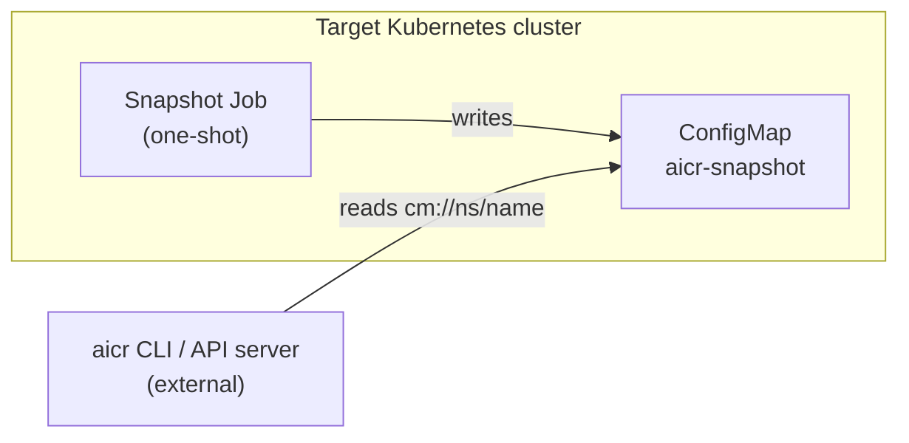

# AICR Contributor Guide

You've landed in the contributor entry point. Its job is to give you,
in five minutes, a clear answer to four questions:

1. What is AICR, and what shape does it have?
2. Is the change I want to make in or out of scope?
3. Which file or package do I touch?
4. Where do I go next?

For dev-environment setup, run `make tools-setup` and read
[DEVELOPMENT.md](https://github.com/NVIDIA/aicr/blob/main/DEVELOPMENT.md).
For contribution mechanics (DCO, CI, signing), see
[CONTRIBUTING.md](https://github.com/NVIDIA/aicr/blob/main/CONTRIBUTING.md).
For the coding rules every PR is graded against, see
[CLAUDE.md](https://github.com/NVIDIA/aicr/blob/main/.claude/CLAUDE.md).

## What AICR Is

AICR is a **design-time tool**. Given a description of a target
environment — cluster, accelerator, intent, OS, platform — it
generates validated GPU-cluster configuration artifacts that an
established deployment tool (Helm, Argo CD, Flux, Helmfile) consumes.

| Artifact | Role | Produced by |
|----------|------|-------------|
| **Snapshot** | Normalized state of an existing cluster (input) | `aicr snapshot` or the in-cluster Job |
| **Recipe** | Declarative spec resolved from registry, criteria, overlays, and mixins | `aicr recipe` |
| **Validation report** | Recipe constraints evaluated against a snapshot or live cluster | `aicr validate` |
| **Bundle** | Per-component deployment artifact in a tool-specific format | `aicr bundle` |
| **Evidence** | Signed conformance attestation for a validated recipe | `aicr evidence` |

Each stage produces a serializable artifact (file, stdout, or
ConfigMap) and is independently invocable. Reproducibility — same
inputs, same outputs — is non-negotiable.

```text
┌──────────┐    ┌────────┐    ┌──────────┐    ┌────────┐
│ Snapshot │───▶│ Recipe │───▶│ Validate │───▶│ Bundle │
└──────────┘    └────────┘    └──────────┘    └────────┘
   capture       generate       check          emit
   cluster       optimized      constraints    deployment
   state         config         vs. actual     artifacts
```

Stages can be invoked individually or chained. Inputs and outputs
flow through files, stdout, or Kubernetes ConfigMaps
(`cm://namespace/name`), which lets the snapshot agent hand off to a
CLI or API server running outside the cluster.

## What AICR Is Not

AICR is not a deployment engine. The boundary matters: half of all
"can AICR do X?" questions resolve against this list.

| AICR does | AICR does **not** |
|-----------|------------------|
| Generate `values.yaml`, `Application`, `HelmRelease`, etc. | Run `kubectl apply` or `helm install` |
| Validate constraints against a snapshot | Wait for resources to become ready |
| Sign and verify evidence bundles | Implement uninstall, rollback, or upgrade |
| Capture cluster state via a one-shot Job | Reconcile drift or run as a controller |
| Emit per-component artifacts in known formats | Orchestrate cross-component dependencies at runtime |

The deployment tool that consumes AICR's output (Helm, Argo CD, Flux,
Helmfile) owns release reconciliation and lifecycle.

**On terminology.** Code under `pkg/bundler/deployer` includes things
we call *deployers*. They are **output adapters** that serialize a
bundle in a tool-specific format. They do not perform deployment.

The only in-cluster component is the **snapshot agent** — a one-shot
Kubernetes Job that captures state into a ConfigMap and exits. It is
an input collector, not a runtime component, and is not part of the
deployed system.

## Is My Change In Scope?

The single most useful question to answer before writing code. If you
land in the right-hand column, file an issue or ADR first — the
review will not get past `make qualify` regardless of code quality.

| In scope (artifact generation) | Out of scope (deployment-time) |
|--------------------------------|--------------------------------|
| New recipe overlay or mixin | Apply / wait / uninstall logic embedded in AICR |
| New registry entry for an upstream chart | Drift detection or reconciliation loops |
| New snapshot collector dimension | In-cluster controllers or operators owned by AICR |
| New constraint operator | Custom deployment mechanisms (e.g., a "direct" deployer that calls `kubectl apply`) |
| New bundle output for a community-standard tool | Custom or proprietary delivery pipelines |
| Supply-chain provenance (SBOM, attestation, signing) | Anything that keeps AICR running past artifact generation |

A rule of thumb: if a feature requires AICR to keep running after
artifact generation, or to drive `kubectl` and direct API calls to
deploy what it produces, it belongs in a deployment tool — not AICR.

## Where Does My Change Go?

The contributor decision matrix. Find the row that matches your
intent; the linked page has the walkthrough.

| I want to... | Touch | Guide |
|--------------|-------|-------|
| Make an existing Helm or Kustomize chart available to recipes | `recipes/registry.yaml` entry | [component.md](component.md) |
| Pin a chart version, set values, or define scheduling for a specific cluster shape | Recipe overlay in `recipes/overlays/` | [recipe.md](recipe.md) |
| Share OS or platform fragments across overlays | Recipe mixin in `recipes/mixins/` | [recipe.md](recipe.md#mixin-composition) |
| Capture a new dimension of cluster / OS / GPU state | New collector in `pkg/collector/<kind>/` | [collector.md](collector.md) |
| Add a new declarative constraint operator (`>=`, tolerance, etc.) | `pkg/constraints` | [validator.md](validator.md) |
| Add a container-per-validator check (NCCL variant, perf benchmark) | `validators/<phase>/` + `recipes/validators/catalog.yaml` | [validator.md](validator.md) |
| Warn or block on a component misconfiguration at bundle time | `pkg/bundler/validations/checks.go` + `registry.yaml` | [validator.md](validator.md#component-validations-bundle-time) |
| Verify a deployed component is healthy via chainsaw | `recipes/checks/<name>/health-check.yaml` | [validator.md](validator.md) |
| Add or change a CLI flag or subcommand | `pkg/cli/<name>.go` + register in `pkg/cli/root.go` | [cli.md](cli.md) |
| Add an HTTP endpoint | `pkg/server/<name>_handler.go` + `api/aicr/v1/server.yaml` | [api-server.md](api-server.md) |
| Add a new community-standard bundle output format | `pkg/bundler/deployer/<name>/` | Open an issue first — discuss before coding |
| Cut a release | `tools/release` + `git push origin <tag>` | [maintaining.md](maintaining.md) |
| Run unit / chainsaw / KWOK / e2e tests | `make qualify` and friends | [tests.md](tests.md) |

## Your First Contribution

A typical first PR path:

1. Read [CONTRIBUTING.md](https://github.com/NVIDIA/aicr/blob/main/CONTRIBUTING.md)
   and [CLAUDE.md](https://github.com/NVIDIA/aicr/blob/main/.claude/CLAUDE.md).
2. Run `make tools-setup` then `make qualify`. If qualify is green on
   `main`, your environment works.
3. Find your change in the [decision matrix](#where-does-my-change-go).
   Open the linked guide and follow its walkthrough.
4. Write the change. Run `make qualify` (or the package-scoped
   subset) until it passes. Lint and test failures must be fixed
   locally — do not rely on CI.
5. If you changed `registry.yaml`, a component values file, or a
   chart pin, run `make bom-docs` and commit the regenerated
   `docs/user/container-images.md`. CLAUDE.md treats this as a
   hard rule.
6. Sign the commit (`git commit -S`), open a PR, and let CI run.

Use the PR template in `.github/PULL_REQUEST_TEMPLATE.md` as-is — do
not inline a modified copy. Reviewers grade against
[CLAUDE.md](https://github.com/NVIDIA/aicr/blob/main/.claude/CLAUDE.md);
familiarity with the anti-patterns table is the difference between
"shipped" and "round trip."

## Codebase Shape

Three layers. The separation is the single most enforced rule in
review.

```text
   ┌─────────────────────┐     ┌─────────────────────┐
   │   pkg/cli           │     │   pkg/server        │   user interaction
   │   (CLI commands)    │     │   (HTTP handlers)   │   — no business logic
   └──────────┬──────────┘     └──────────┬──────────┘
              │                            │
              ▼                            ▼
              ┌──────────────────────────────┐
              │      pkg/client/v1           │           shared facade
              │      (aicr.Client)           │
              └────────────────┬─────────────┘
                               │
                               ▼
   ┌───────────────────────────────────────────────────┐
   │  pkg/recipe   pkg/collector   pkg/validator       │   functional packages
   │  pkg/bundler  pkg/snapshotter pkg/evidence        │   — business logic lives here
   │  pkg/constraints  pkg/serializer  pkg/manifest    │
   └───────────────────────────────────────────────────┘
```

`pkg/cli` and `pkg/server` parse input, validate it, and format
output. **They contain no business logic.** All business logic lives
in functional packages, composed by the `pkg/client/v1` facade so
both entry points share it. Adding business logic to `pkg/cli` or
`pkg/server` handlers is a boundary violation and will be rejected.

## Packages

| Package | Responsibility |
|---------|----------------|
| **User interaction** | |
| `pkg/cli` | CLI flags, output formatting, exit-code mapping. [cli.md](cli.md) |
| `pkg/server` | HTTP server: middleware chain + REST handlers (thin adapters). [api-server.md](api-server.md) |
| `pkg/client/v1` | `aicr.Client` facade — shared SDK used by CLI, server, and external Go callers |
| **Recipe and data** | |
| `pkg/recipe` | Recipe resolution, overlay/mixin composition, registry. [recipe.md](recipe.md) |
| `pkg/recipe/oskind` | Single source of truth for OS criterion string values (`ubuntu`, `rhel`, `cos`, `amazonlinux`, `talos`). Imported by `pkg/recipe`, `pkg/collector`, `pkg/snapshotter`, and the CLI. |
| `pkg/constraints` | Declarative constraint operators (`>=`, `<=`, tolerance) and evaluation |
| `pkg/measurement` | Schema for collector output and validator input |
| `pkg/serializer` | Deterministic YAML/JSON for evidence and bundles |
| `pkg/config` | CLI/server config file (`--config`) loader |
| **Collection and validation** | |
| `pkg/collector` | Parallel system state collection. [collector.md](collector.md) |
| `pkg/snapshotter` | Orchestrates collectors, aggregates measurements |
| `pkg/validator` | Constraint evaluation; container-per-validator runner. [validator.md](validator.md) |
| `pkg/fingerprint` | Cluster shape fingerprint for caching and provenance |
| **Bundle generation** | |
| `pkg/bundler` | Per-component bundle generation entry point. [component.md](component.md) |
| `pkg/bundler/deployer` | Output adapters: `helm`, `helmfile`, `argocd`, `argocdhelm`, `flux` |
| `pkg/bundler/validations` | Bundle-time component validation checks. [validator.md](validator.md#component-validations-bundle-time) |
| `pkg/component` | Bundler utilities and test helpers |
| `pkg/manifest`, `pkg/helm`, `pkg/bom` | Manifest rendering, chart inspection, BOM extraction |
| **Supply chain** | |
| `pkg/evidence` | Conformance evidence capture, signing, verification |
| `pkg/oci` | OCI artifact push/pull for evidence and bundles |
| `pkg/mirror` | Air-gap mirror for charts and images |
| `pkg/trust` | Sigstore trust root management |
| `pkg/build` | Build provenance metadata |
| **Cross-cutting** | |
| `pkg/k8s/client` | Singleton Kubernetes clientset (in-cluster + kubeconfig) |
| `pkg/k8s/pod` | Shared K8s Job/Pod helpers (wait, logs, ConfigMap URI parsing) |
| `pkg/errors` | Structured errors with codes; HTTP and exit-code mapping |
| `pkg/defaults` | Centralized timeouts, limits, configuration constants |
| `pkg/logging` | Structured slog setup with TTY / `NO_COLOR` detection |
| `pkg/header`, `pkg/version`, `pkg/diff` | API negotiation headers, build version, snapshot/recipe diff |

## Community-Standard Deployment Targets

AICR emits artifacts in formats consumed by community-standard
deployment tools:

| Deployer | Output | Use case |
|----------|--------|----------|
| `helm` | Per-component `values.yaml` + install script | Direct Helm install |
| `helmfile` | `helmfile.yaml` declarative release manifest | GitOps with Helmfile |
| `argocd` | Argo CD `Application` manifests with sync-waves | Argo CD GitOps |
| `argocdhelm` | Argo CD `Application` referencing per-component Helm charts | Argo CD + upstream Helm |
| `flux` | Flux `HelmRelease` + `Kustomization` manifests | Flux GitOps |

We are open to adding additional community-standard targets when
there is demonstrated demand. We do **not** add custom or
proprietary deployment mechanisms: they pull deployment-time
orchestration into AICR — the boundary we are explicitly maintaining.

## Deployment Topologies

AICR can be invoked in three shapes. None are runtime components in
the deployed cluster — all are design-time tooling.

- **CLI.** Single binary. Local development, CI pipelines,
  troubleshooting.
- **API server.** Stateless HTTP service for programmatic recipe and
  bundle generation. Scales horizontally behind a load balancer.
  Returns artifacts; does not deploy them. See
  [api-server.md](api-server.md).
- **Snapshot agent (one-shot Job).** A Kubernetes Job that runs
  once, captures state into a ConfigMap, and exits. The CLI or API
  server reads the ConfigMap as input. No reconcile loop, no
  controller.



## Architectural Principles

Coding rules and anti-patterns live in
[CLAUDE.md](https://github.com/NVIDIA/aicr/blob/main/.claude/CLAUDE.md).
The four principles that shape the architecture itself:

- **Metadata is separate from how it is consumed.** Validated
  configuration exists independent of how it is rendered, packaged,
  or deployed. A recipe is a value, not a procedure.
- **Correctness must be reproducible.** Same inputs → same outputs.
  This rules out hidden state, implicit defaults, and
  non-deterministic serialization. `serializer.MarshalYAMLDeterministic`
  is required wherever output feeds a digest, signature, or
  fingerprint.
- **Recipe specialization requires explicit intent.** Generic intent
  must never silently resolve to a specialized configuration. If two
  recipes both match, the user explicitly chooses; AICR does not
  guess.
- **Trust requires verifiable provenance.** Every released artifact
  carries verifiable, non-falsifiable proof of where it came from.
  See [SECURITY.md](https://github.com/NVIDIA/aicr/blob/main/SECURITY.md).

## Key Engineering Decisions

These five decisions shape how the codebase is laid out. Code that
fights them tends to read as a re-architecture.

- **Concurrent collection with `errgroup`.** Collectors run in
  parallel; failure of any collector cancels the rest via context.
  Fail-fast is the default; best-effort partial collection would
  hide systemic problems behind partial data.
- **Pluggable collectors via factory.** Collectors implement a
  common interface and are constructed by `pkg/collector.Factory`,
  then wired into the snapshot run by `pkg/snapshotter`. Adding a
  state source means a new `Factory` method and one `g.Go(...)`
  line in the snapshotter — no edits to existing collectors. See
  [collector.md](collector.md).
- **Immutable recipe store.** Read-only after init. Mutations on
  per-request clones. No locks; API server is safe for concurrent
  reads.
- **Singleton Kubernetes client.** `pkg/k8s/client` caches a single
  clientset to avoid connection exhaustion. Both in-cluster and
  out-of-cluster auth are supported transparently.
- **Watch over poll.** Long-running K8s operations use the watch API
  rather than polling loops. See `pkg/k8s/pod`.

## Where to Next

By contributor task:

- **Adding recipes, overlays, mixins, components** → [recipe.md](recipe.md)
- **Adding a registry entry (Helm or Kustomize chart)** → [component.md](component.md)
- **Adding a CLI command** → [cli.md](cli.md)
- **Adding an HTTP endpoint** → [api-server.md](api-server.md)
- **Adding a snapshot collector** → [collector.md](collector.md)
- **Adding a validator check** → [validator.md](validator.md)
- **Adding a bundle-time component validation** → [validator.md](validator.md#component-validations-bundle-time)
- **Maintaining recipes and cutting releases** → [maintaining.md](maintaining.md)
- **Writing or running tests (unit, chainsaw, KWOK, e2e)** → [tests.md](tests.md)

By reference:

- [CONTRIBUTING.md](https://github.com/NVIDIA/aicr/blob/main/CONTRIBUTING.md) — contribution process, DCO, CI/CD, E2E testing
- [DEVELOPMENT.md](https://github.com/NVIDIA/aicr/blob/main/DEVELOPMENT.md) — dev environment setup and Make targets
- [RELEASING.md](https://github.com/NVIDIA/aicr/blob/main/RELEASING.md) — release process for maintainers
- [SECURITY.md](https://github.com/NVIDIA/aicr/blob/main/SECURITY.md) — supply-chain security, attestation verification
- [CLAUDE.md](https://github.com/NVIDIA/aicr/blob/main/.claude/CLAUDE.md) — coding rules, error wrapping, context, HTTP, logging, K8s patterns
- [docs/design/](https://github.com/NVIDIA/aicr/tree/main/docs/design) — accepted ADRs
- [docs/integrator/](https://github.com/NVIDIA/aicr/tree/main/docs/integrator) — embedding AICR in your platform
- [docs/user/](https://github.com/NVIDIA/aicr/tree/main/docs/user) — end-user reference (CLI flags, API endpoints, component catalog)
